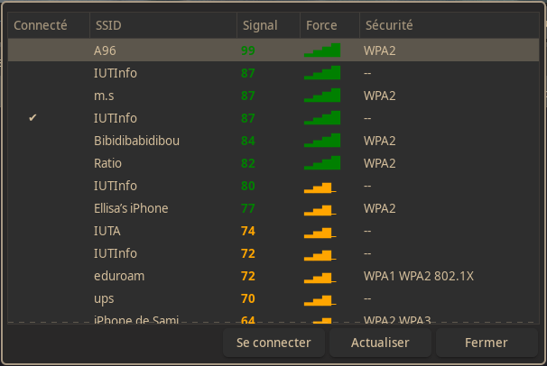

# NetworkInterface

**NetworkInterface** est un script Bash permettant d'afficher une interface graphique simple pour se connecter à un réseau Wi-Fi à l'aide de `yad` et `nmcli`.

## Fonctionnalités
- Affichage d'une liste des réseaux Wi-Fi disponibles avec indication de la force du signal.
- Connexion rapide à un réseau Wi-Fi existant ou nouvellement détecté.
- Demande du mot de passe pour les réseaux sécurisés.
- Compatible avec Debian, Ubuntu et Arch Linux.

<p align="center">
  
</p>

## Pré-requis
Le script nécessite plusieurs dépendances pour fonctionner correctement.

### Installation des dépendances
#### Pour Debian/Ubuntu :
```sh
sudo apt update && sudo apt install -y xdotool x11-utils yad network-manager gawk
```

#### Pour Arch Linux :
```sh
sudo pacman -Syu --needed xdotool xorg-xrandr yad networkmanager gawk
```

### Vérification du service `NetworkManager`
Assurez-vous que `NetworkManager` est bien activé et fonctionne correctement :
```sh
sudo systemctl enable --now NetworkManager
nmcli device wifi list # Doit afficher la liste des réseaux disponibles
```

## Installation
Clonez ce dépôt et donnez les permissions d'exécution au script :
```sh
git clone https://github.com/IAidenI/NetworkInterface.git
cd NetworkInterface
chmod +x network_interface.sh
./network_interface.sh
```

## Dépannage
Si le script ne fonctionne pas correctement, voici quelques solutions possibles :
- **Le service `NetworkManager` n'est pas actif** :
  ```sh
  sudo systemctl restart NetworkManager
  ```
- **Problème d'affichage avec `yad`** :
  - Assurez-vous que `X11` est bien installé sur votre système.
  - Lancez le script depuis un environnement graphique (pas depuis une session SSH sans `X11 Forwarding`).
- **Problème de détection des réseaux** :
  - Vérifiez si `nmcli` détecte bien les réseaux :
    ```sh
    nmcli device wifi list
    ```
  - Si la commande précédente ne retourne rien, redémarrez votre carte Wi-Fi :
    ```sh
    nmcli radio wifi off && sleep 2 && nmcli radio wifi on
    ```

## Ajout possible
- [ ] Ajouter une option pour oublier un réseau Wi-Fi enregistré.
- [ ] Utiliser `--tree` pour afficher plus de détails sur les réseaux (ex : BSSID, fréquence).
- [ ] Explorer des alternatives à `yad` pour éviter de devoir recharger une nouvelle page à chaque rafraîchissement.